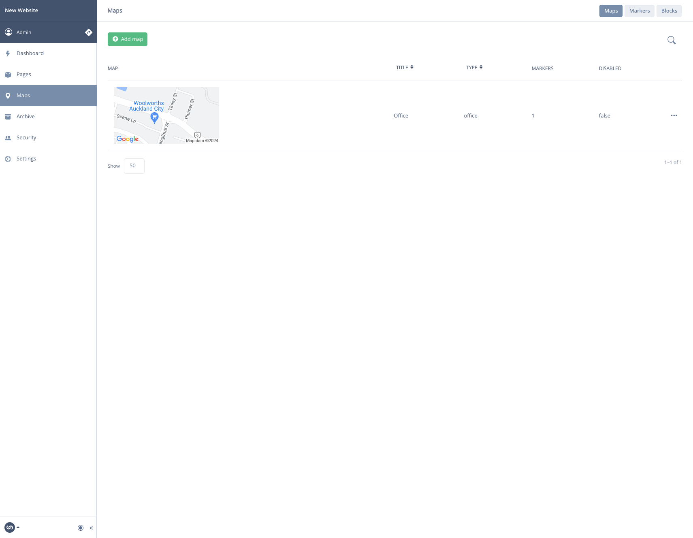
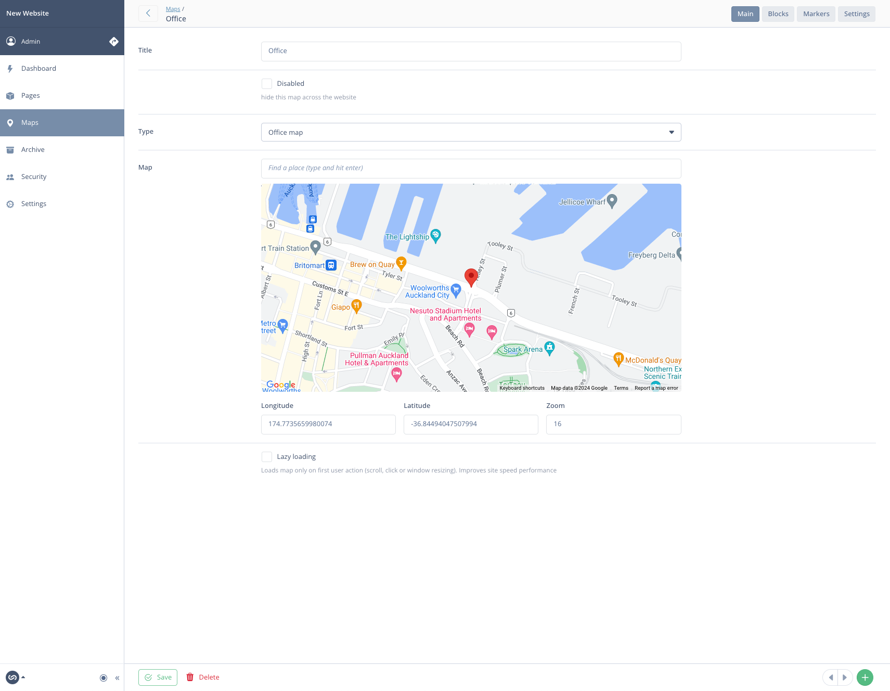
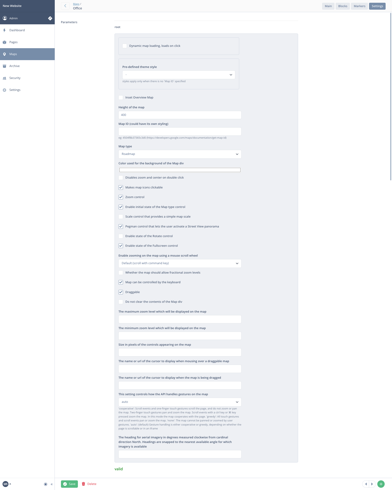
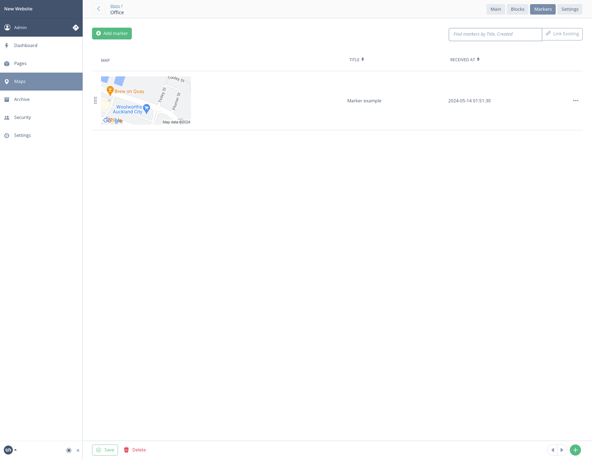
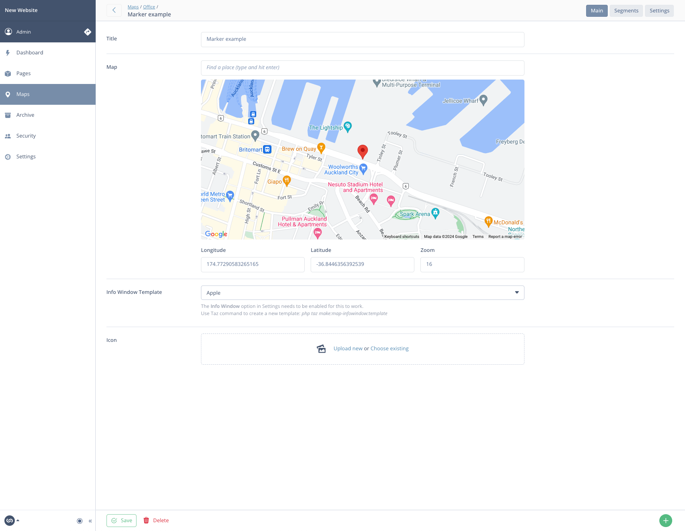
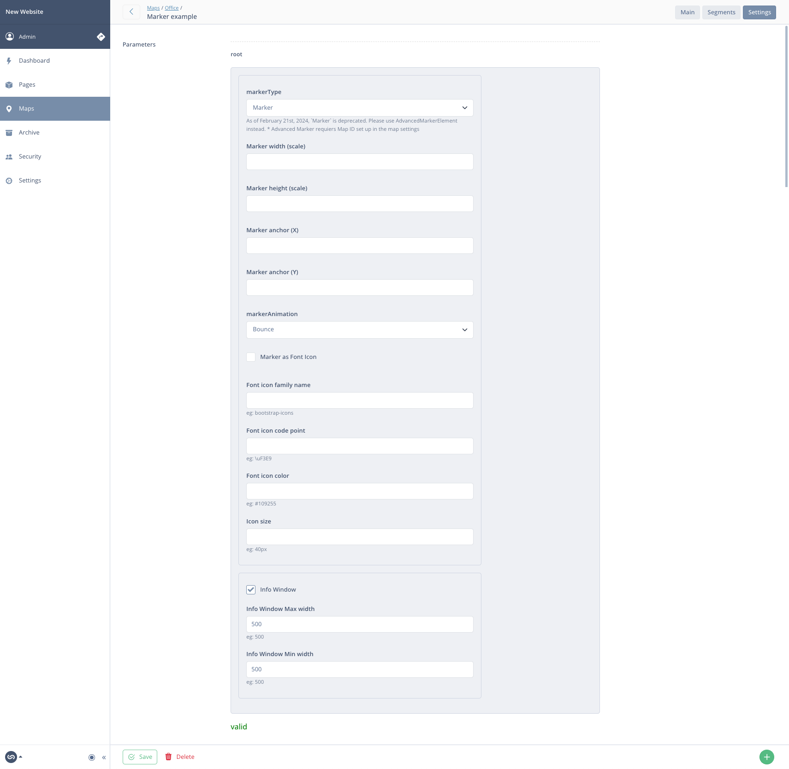

# 🦅 Google Maps for Silverstripe

[](https://packagist.org/packages/goldfinch/google-maps)
[](https://packagist.org/packages/goldfinch/google-maps)
[](https://packagist.org/packages/goldfinch/google-maps)
[](https://packagist.org/packages/goldfinch/google-maps)

The module helps to create and manage **Google Maps** 🌏 in your Silverstripe project. It comes with comprehensive settings that you can use to your advantage. Whether you need to create simple or complex maps 🗺️, markers 📍 and more.

## Install

#### 1. Install module

```bash
composer require goldfinch/google-maps
```

#### 2. Create Google Cloud API key with the required libraries

There are two **API Libraries** that need to be enabled for the proper work of this module.

- [Maps JavaScript API](https://console.cloud.google.com/apis/library/maps-backend.googleapis.com) for maps integration
- [Maps Static API](https://console.cloud.google.com/apis/library/static-maps-backend.googleapis.com) for maps thumbnails and previews

#### 3. Add Google Cloud API key to your **.env**

```bash
APP_GOOGLE_MAPS_KEY=""
```

#### 4. Implement JavaScript front-end component

_via Silverstripe Requirements PHP_

```php
Requirements::javascript('goldfinch/google-maps:client/dist/map.js');
```

_via template require_

```html
<% require javascript('goldfinch/google-maps:client/dist/map.js') %>
```

_via ES6 module_

```bash
npm i @googlemaps/js-api-loader
```

```js
import GoogleMap from '..../vendor/goldfinch/google-maps/client/src/src/map-mod'

// import GoogleMap from '@goldfinch/google-maps/src/map-mod'; // with alias

document.addEventListener('DOMContentLoaded', () => {
  new GoogleMap()
})
```

```js
// vite.config.js
// * only if you use alias import above

import { defineConfig } from 'vite'

export default defineConfig(({ command, mode }) => {
  return {
    // ..

    resolve: {
      alias: [{ find: '@goldfinch', replacement: fileURLToPath(new URL('./vendor/goldfinch', import.meta.url)) }]
    }

    // ..
  }
})
```

## Available Taz commands

If you haven't used [**Taz**](https://github.com/goldfinch/taz)🌪️ before, _taz_ file must be presented in your root project folder `cp vendor/goldfinch/taz/taz taz`

---

> Create map segment

```bash
php taz make:map-segment
```

> Create InfoWindow template

```bash
php taz make:map-infowindow:template
```

> Create MapBlock extension

```bash
php taz vendor:google-maps:ext:block
```

> Create Config extension

```bash
php taz vendor:google-maps:ext:config
```

> Create MapsAdmin extension

```bash
php taz vendor:google-maps:ext:admin
```

> Create MapSegment extension

```bash
php taz vendor:google-maps:ext:segment
```

> Create full Yaml config (further config amends are required, you might want to remove what you don't need)

```bash
php taz vendor:google-maps:config
```

> Publish all available templates

```bash
php taz vendor:google-maps:templates
```

> Runs a bundle of all available `vendor:google-maps:*` commands

```bash
php taz vendor:google-maps
```

## How to create a new map

Each **Google Map** is built on what is called **Map Segment**.

#### 1. Create a map segment

Use [**Taz**](https://github.com/goldfinch/taz)🌪️ to generate new Map Segment. It will quickly lead you through the setup and take care of it for you.

```bash
php taz make:map-segment
```

#### 2. Create map record in CMS

Go to `/admin/maps` and add new map. In the **Type** we need to select our map segment that has been created the step before (should be selected by default). You can go ahead, add markers and check out the _Settings_ tab if you want.

#### 3. Custom Info Window template (optional)

This module comes with various settings for Maps and Markers. You can also add Info Window for markers and easily customize it for your needs. All you need to do is create your custom InfoWindow template by using **Taz**

```bash
php taz make:map-infowindow:template
```

Once it's been created, you can go to any marker record you added to your map and select your custom template in **Info Window Template** dropdown.

## Usage

#### Across templates

Using **GoogleMaps** global provider.

> Render map segment template by type

```html
$GoogleMaps.bySegment(office).RenderSegmentMap
```

> Render map frame only by type

```html
$GoogleMaps.bySegment(office).MapElement
```

> Render map segment template by ID

```html
$GoogleMaps.byID(1).RenderSegmentMap
```

> Render map frame only by ID

```html
$GoogleMaps.byID(1).MapElement
```

#### Using elemental block

If you prefer using [silverstripe/silverstripe-elemental](https://github.com/silverstripe/silverstripe-elemental), you can take a look at **Map** block that already comes with this module.

## Sidenotes

_Google Maps_ iframes might have a blue border that you want to get rid of.

```scss
.gm-style iframe + div {
  border: none !important;
}
```

_As of February 21st, 2024, Marker is deprecated. Please use AdvancedMarkerElement instead._

## Events

- [Map events](https://developers.google.com/maps/documentation/javascript/events)
- [Marker events](https://developers.google.com/maps/documentation/javascript/reference/marker#Marker-Events)
- [AdvancedMarkerElement events](https://developers.google.com/maps/documentation/javascript/reference/advanced-markers#AdvancedMarkerElement-Events)
- [Info Window events](https://developers.google.com/maps/documentation/javascript/reference/info-window#InfoWindow-Events)

Available JavaScript callback events

```js
window.goldfinch = {}

window.goldfinch.map_callback = (map, mapSettings, segment, parameters) => {
  // ..
}
window.goldfinch.marker_callback = (marker, markerParams, e, map, segment, parameters) => {
  // ..
}
window.goldfinch.infoWindow_callback = (infoWindow, infowindowParams, marker, map, e, segment, parameters) => {
  // ..
}
```

## Previews

#### Admin



#### Map segment



#### Map segment settings



#### Map's markers



#### Marker item



#### Marker settings



## License

The MIT License (MIT)
